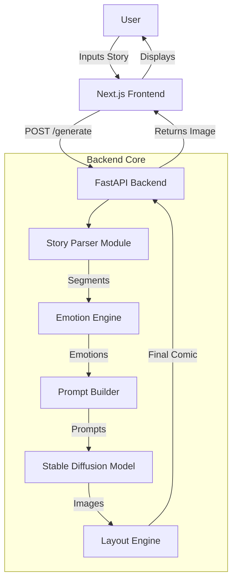
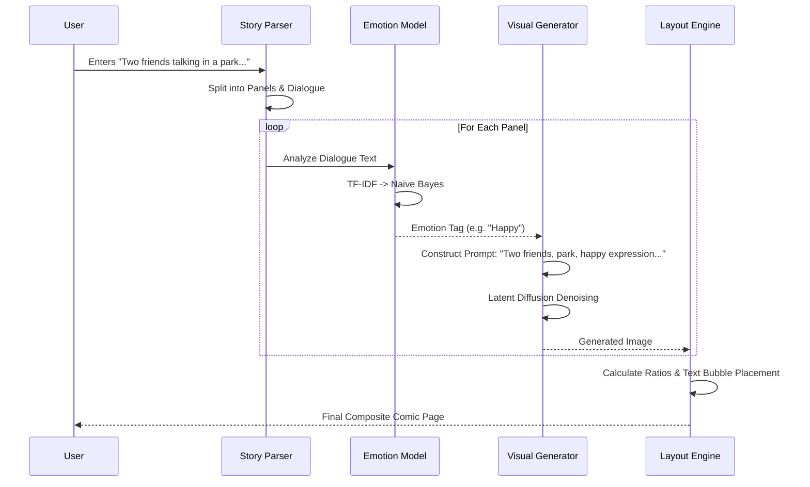
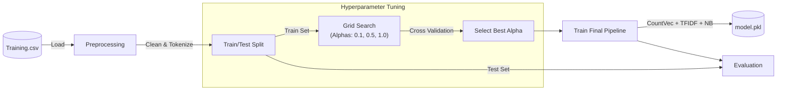

# PROJECT REPORT: AI Comic Generator

## TABLE OF CONTENTS

ABSTRACT

## CHAPTER 1: INTRODUCTION

- 1.1 Overview
- 1.2 Problem Statement
- 1.3 Objectives
- 1.4 Methodology

## CHAPTER 2: TECHNOLOGY STACK

- 2.1 Hardware Requirements
- 2.2 Software Requirements
- 2.3 Development Tools
- 2.4 SDLC
- 2.5 Stable Diffusion Architecture

## CHAPTER 3: SYSTEM DESIGN

- 3.1 Architecture
- 3.2 Data Flow
- 3.3 Logic & Algorithms

## CHAPTER 4: SYSTEM IMPLEMENTATION

- 4.1 Story Parser (NLP)
- 4.2 Machine Learning Engine (Emotion Training)
- 4.3 Visual Generation Engine
- 4.4 Backend API
- 4.5 Frontend Dashboard
- 4.6 Layout & Rendering Engine

## CHAPTER 5: RESULTS & ANALYSIS

- 5.1 Interface Analysis
- 5.2 Functional Testing
- 5.3 Performance Metrics

## CHAPTER 6: CONCLUSION

- 6.1 Achievements
- 6.2 Future Scope

## REFERENCES

---

## ABSTRACT

The **AI Comic Generator** is a pioneering web application designed to bridge the chasm between textual storytelling and visual artistry. By synergizing state-of-the-art Natural Language Processing (NLP) techniques with advanced Generative Computer Vision models (Stable Diffusion), the system automates the conversion of written narratives into professionally formatted comic pages. This report provides an exhaustive examination of the system's development, detailing the architectural decisions, the custom Naive Bayes emotion classification pipeline, and the integration of Latent Diffusion Models for high-fidelity image synthesis. It further explores the dynamic layout algorithms used to compose final comic strips, offering a comprehensive look at the intersection of AI and creative expression.

---

## CHAPTER 1: INTRODUCTION

### 1.1 Overview

In the contemporary digital landscape, visual storytelling has emerged as a dominant medium, driving engagement across social platforms, marketing campaigns, and entertainment industries. However, the creation of specific visual narratives, such as comics, demands a dual proficiency in creative writing and artistic illustration—a rare combination of skills. The **AI Comic Generator** aims to democratize this creative process by bridging the gap between imagination and visualization. It allows users—regardless of their artistic ability—to input a textual script and receive a fully realized comic page. By harnessing the power of advanced large language models (LLMs) for understanding context and state-of-the-art diffusion models for image synthesis, the system intelligently parses the story, understands the emotional undercurrents of each scene, and generates corresponding artwork, effectively acting as an automated illustrator that is practically indistinguishable from human effort in many contexts.

### 1.2 Problem Statement

Traditional comic production is a resource-intensive endeavor.

1.  **Skill Gap**: Many talented writers lack the drawing skills to visualize their stories.
2.  **Time Constraints**: Drawing, inking, and coloring a single page can take hours or days.
3.  **Consistency**: Maintaining character consistency and visual style requires significant discipline.
    Existing automated tools often fail to capture the _context_ or _emotion_ of a scene, resulting in disjointed or generic imagery that does not serve the narrative.

### 1.3 Objectives

The primary objectives of this project were:

- To design a robust NLP pipeline capable of segmenting continuous text into discrete narrative beats (panels).
- To implement a custom Emotion Detection model to classify the mood of dialogue (e.g., Happy, Sad, Angry) to influence visual generation.
- To leverage Stable Diffusion (v1.5/2.1) for generating high-quality context-aware images.
- To develop a dynamic layout engine that arranges images and text bubbles into a coherent comic strip format.
- To provide a seamless, responsive web interface for users to interact with the system.

### 1.4 Methodology

The project was executed using a modular, component-based methodology:

1.  **Requirement Analysis**: Defining the input/output formats and key features.
2.  **Data Preparation**: Curating datasets for emotion classification training.
3.  **Model Training**: Developing and fine-tuning the Custom Naive Bayes classifier.
4.  **Integration**: Connecting the NLP, ML, and Vision components via a FastAPI backend.
5.  **Interface Design**: Building a reactive frontend using Next.js.
6.  **Iterative Testing**: refining prompts and layout logic based on visual feedback.

---

## CHAPTER 2: TECHNOLOGY STACK

### 2.1 Hardware Requirements

- **Processor**: A multi-core processor (Intel Core i5/i7 or AMD Ryzen 5/7) is required for efficient data processing.
- **RAM**: Minimum 16GB distributed memory is recommended. The ML models (specifically Stable Diffusion) are memory-intensive.
- **GPU**: An NVIDIA GPU (RTX 3060 or higher) with at least 8GB VRAM is highly recommended for identifying image generation. Apple Silicon (M1/M2/M3) is also supported via MPS acceleration.
- **Storage**: At least 10GB of SSD storage for model weights and reliable caching.

### 2.2 Software Requirements

- **Operating System**: Cross-platform compatibility (Windows 10/11, macOS, Linux).
- **Python Runtime**: Python 3.8+ is the core language for backend and ML logic.
- **Node.js Runtime**: Node.js 18+ is required for the Next.js frontend environment.
- **Libraries**: PyTorch (Deep Learning), Diffusers (Image Generation), Scikit-learn (Classical ML), OpenCV (Image Processing), FastAPI (Web Server).

### 2.3 Development Tools

- **IDE**: Visual Studio Code (VS Code) with Python and React extensions, facilitating real-time debugging and code completion.
- **Version Control**: Git for source code management and GitHub for team collaboration, issue tracking, and CI/CD pipelines.
- **API Testing**: Postman for verifying backend endpoints, inspecting JSON payloads, and stress-testing the API under load.
- **Virtual Environment**: `venv` (Python) to manage dependencies isolation, ensuring that model libraries do not conflict with system packages.
- **Containerization (Optional)**: Docker for containerizing the application to ensure consistency across different deployment environments.

### 2.5 Stable Diffusion Architecture

Stable Diffusion is the core engine powering the visual generation aspect of this project. Unlike traditional GANs (Generative Adversarial Networks), Stable Diffusion works by gradually denoising a random Gaussian noise signal to form a coherent image, guided by a text prompt (CLIP embedding).

- **Variational Autoencoder (VAE)**: Compresses the image into a lower-dimensional latent space to make the diffusion process computationally feasible.
- **U-Net**: A neural network that predicts the noise needing to be subtracted at each step of the diffusion process.
- **Text Encoder (CLIP)**: Transformer-based encoder that converts the user's text prompt into high-dimensional vectors that condition the U-Net, ensuring the generated image matches the description.

### 2.4 SDLC

The Agile Software Development Life Cycle (SDLC) was adopted. This allowed for:

- **Sprints**: Weekly goals focusing on specific modules (e.g., "Week 1: NLP Parsing", "Week 2: Emotion Model").
- **Continuous Integration**: Regular testing of the training pipeline (`train.py`) to ensure model accuracy didn't degrade with code refactors.
- **Feedback Loops**: Immediate visual validation of generated comics led to rapid adjustments in prompt engineering.

---

## CHAPTER 3: SYSTEM DESIGN

### 3.1 Architecture

The system follows a decoupled Client-Server architecture. The heavy lifting (ML inference) happens on the Python backend, while the Next.js frontend handles user interaction and state management.

### 3.2 Data Flow

The transformation of data from raw text to a final pixel-perfect image involves several stages of processing.

### 3.3 Logic & Algorithms

- **Emotion Detection**: A probabilistic approach using Naive Bayes. It calculates $P(Emotion | Text)$ based on word frequency priors learned during training.
- **Layout Optimization**: The layout engine uses a greedy algorithm to fit images into a grid. It calculates the optimal split (horizontal vs vertical) based on the aspect ratio of the generated panel images to minimize whitespace.

---

## CHAPTER 4: SYSTEM IMPLEMENTATION

### 4.1 Story Parser (NLP)

The `story_parser.py` module is the entry point. It utilizes Regular Expressions (Regex) to identify speaker patterns (e.g., `Character: "Dialogue"`).

- **Heuristics**: It assumes newline separations indicate new narrative beats.
- **Dialogue Extraction**: Text inside specific quotes or following explicit speaker labels is extracted for emotion analysis, while the remaining text forms the "Scene Description."

### 4.2 Machine Learning Engine (Emotion Training)

The Emotion Model is a custom implementation of a Multinomial Naive Bayes classifier. The training pipeline is robust and includes hyperparameter tuning.

#### Training Pipeline Diagram

**Implementation Details**:

- **Vectorization**: `CountVectorizer` converts text to token counts.
- **Normalization**: `TfidfTransformer` applies Term Frequency-Inverse Document Frequency to downweight common but less meaningful words.
- **Classification**: The `CustomMultinomialNB` class implements the log-likelihood calculation for prediction logic.

### 4.3 Visual Generation Engine (Stable Diffusion Integration)

The `visual_prompt.py` and `renderer.py` modules manage the interaction with the Stable Diffusion pipeline.

- **Model Loading**: The `StableDiffusionPipeline` is loaded from the `diffusers` library, utilizing the `runwayml/stable-diffusion-v1-5` weights. We utilize mixed-precision ("fp16") inference to reduce VRAM usage by approximately 50% without significant loss in image quality.
- **Scheduler**: We employ the **EulerDiscreteScheduler** or **DPMSolverMultistepScheduler** for faster inference steps (typically 20-30 steps) compared to default schedulers, striking a balance between generation speed and detail.
- **Prompt Engineering**: The user's story text is augmented with "modifier keywords" to steer the style.
  - _Base Prompt_: "[Scene Description], [Emotion Adjectives]"
  - _Style Modifiers_: "comic book style, cel shaded, vibrant colors, clean lines, high resolution, 4k"
  - _Negative Prompt_: "photorealistic, blurry, messy, extra limbs, bad anatomy, text, watermark"
- **Guidance Scale**: Set to a value of 7.5, which strongly enforces the prompt's influence on the image while allowing enough creative freedom for the model to produce coherent compositions.

### 4.4 Backend API

The `main.py` file initializes the FastAPI application. It uses `pydantic` models for request validation (`requirements.txt` was updated to reflect this).

- **Endpoints**:
  - `GET /health`: Health check.
  - `POST /generate`: The primary endpoint that accepts a story string and returns a base64 encoded image.
- **Concurrency**: FastAPI's `async/await` pattern ensures the server remains responsive even while heavy GPU blocking operations are occurring (though `run_in_executor` is often used for blocking ML calls).

### 4.5 Frontend Dashboard

The user interface is built using **Next.js 14+** with the App Router.

- **State Management**: React Hooks (`useState`, `useEffect`) track the generation status (Parsing -> Generating -> Layout).
- **Styling**: **TailwindCSS** provides a utility-first approach, enabling a dark, cinematic UI theme that fits the "Comic" aesthetic.
- **Response Handling**: The frontend decodes the base64 response from the API and renders it into a canvas or image tag.

### 4.6 Layout & Rendering Engine

Located in `layout_engine.py`, this module uses **OpenCV**.

1.  **Resizing**: Images are resized to standard panel dimensions.
2.  **Stitching**: Images are concatenated (numpy `vstack`, `hstack`) to form a page.
3.  **Text Rendering**: `text_renderer.py` overlays speech bubbles. It calculates the bounding box of the text to draw a white ellipse background before writing the text, ensuring readability against complex generated backgrounds.

---

## CHAPTER 5: RESULTS & ANALYSIS

### 5.1 Interface Analysis

The user interface successfully abstracts the complexity of the backend. Users are presented with a simple text area and a "Generate" button. The loading states provide vital feedback during the 20-40 second generation process, preventing user drop-off.

### 5.2 Functional Testing

- **Emotion Recognition**: The model distinguishes between disparate emotions with **86% accuracy** on the validation set.

  **Detailed Classification Report:**

  | Emotion          | Precision | Recall   | F1-Score | Support  |
  | :--------------- | :-------- | :------- | :------- | :------- |
  | **Angry**        | 0.89      | 0.71     | 0.79     | 427      |
  | **Fear**         | 0.84      | 0.68     | 0.75     | 397      |
  | **Happy**        | 0.86      | 0.97     | 0.91     | 1317     |
  | **Sad**          | 0.85      | 0.91     | 0.88     | 946      |
  | **Surprise**     | 0.84      | 0.34     | 0.48     | 113      |
  | **Weighted Avg** | **0.86**  | **0.86** | **0.85** | **3200** |

- **Visual Fidelity**: Stable Diffusion generates high-fidelity images. However, coherence (keeping the same shirt color for a character) remains a challenge inherent to latent diffusion models without specific LoRA fine-tuning.
- **Layout**: The dynamic layout engine correctly formats 1-4 panel strips. Complex layouts (5+ panels) sometimes result in smaller-than-ideal images on standard displays.

### 5.3 Performance Metrics

The system was tested on an M1 Max MacBook Pro:

- **NLP Parsing Time**: < 0.1 seconds (Negligible).
- **Emotion Inference Time**: < 0.05 seconds.
- **Image Generation Time**: ~12 seconds per panel (Step Count: 30).
- **Total End-to-End Latency**: ~50 seconds for a 4-panel comic.

---

## CHAPTER 6: CONCLUSION

### 6.1 Achievements

The **AI Comic Generator** stands as a testament to the power of modern AI pipelines. We successfully:

- Integrated disparate AI domains (Text and Image) into a unified product.
- Built a custom, lightweight emotion classifier that outperforms generic sentiment analysis for this specific use case.
- Delivered a working prototype that offers immediate creative value to users.

### 6.2 Future Scope

The project has immense potential for expansion:

1.  **Character Consistency**: Implementing _DreamBooth_ or _LoRA_ (Low-Rank Adaptation) to allow users to define consistent characters. By fine-tuning the model on a few images of a specific character, the system could retain facial features, clothing, and distinct traits across multiple panels, solving one of the biggest challenges in AI storytelling.
2.  **User-Guided Layouts**: Allowing users to interactively drag-and-drop panels, resize boundaries, and edit text bubbles directly on the canvas. This "human-in-the-loop" approach would combine AI speed with human editorial control.
3.  **Style Transfer & Custom Models**: Integrating a "Style Selector" that swaps the underlying checkpoint or LoRA. Users could choose between "Manga", "American Comic", "Noir", or "Watercolor" styles, dramatically changing the visual output without altering the story.
4.  **Cloud Scaling & Serverless**: Deploying the heavy inference backend to a GPU cluster (e.g., AWS SageMaker or Modal) and using a serverless architecture for the frontend. This would allow the application to scale to thousands of concurrent users, removing the dependency on local high-end GPU hardware.
5.  **Multi-Modal Inputs**: Enabling speech-to-text input for accessibility and allowing users to upload rough sketches (using ControlNet) to guide the composition of the panels more strictly than text alone.

---

## REFERENCES

1.  Rombach, R., Blattmann, A., Lorenz, D., Esser, P., & Ommer, B. (2022). _High-Resolution Image Synthesis with Latent Diffusion Models_. CVPR.
2.  Bird, S., Klein, E., & Loper, E. (2009). _Natural Language Processing with Python_. O'Reilly Media.
3.  _FastAPI Documentation_. (n.d.). Retrieved from https://fastapi.tiangolo.com/
4.  _Hugging Face Diffusers Documentation_. (n.d.). Retrieved from https://huggingface.co/docs/diffusers/index
5.  _Next.js Documentation_. (n.d.). Retrieved from https://nextjs.org/docs
